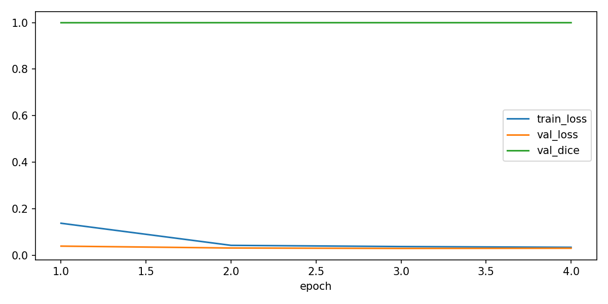
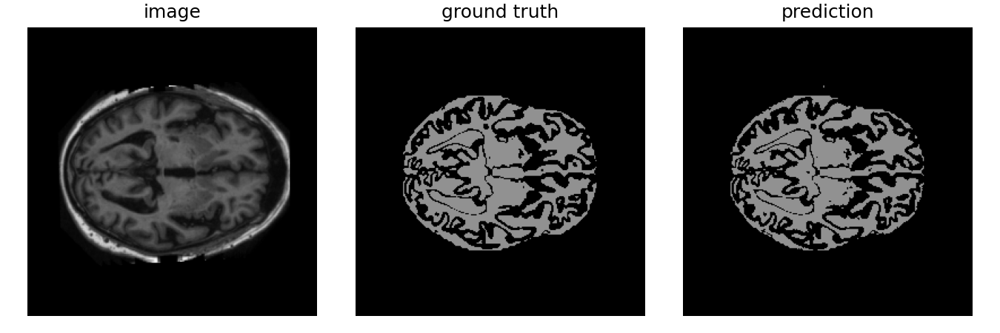

# Improved UNet for 2D OASIS Brain MRI Segmentation
By Niklas Schuck (48832669)
COMP3710
Pattern Recognition Report

## 1. Problem Description
The goal of this project is to perform 2D semantic segmentation on slices of the OASIS Brain MRI dataset. The task evaluates a model’s ability to correctly differentiate structural features from the grayscale MRI images. Each scan in the OASIS dataset consists of 31 slices stored as .nii.png images, which are treated as independent 2D samples for training. The model aims to achieve a minimum Dice coefficient of 0.9 per label on the test set

## 2. Model Overview
The implemented model builds upon the classical UNet encoder-decoder design, integrate the following improvements for accuracy:

Residual Blocks: Each encoder/decoder block includes residual connections for better gradient flow.

Instance Normalisation: Replaces BatchNorm to stabilize training with small batch sizes.

LeakyReLU Activations: Prevents dead neurons and improves convergence.

Dropout Regularization: Reduces overfitting by randomly deactivating neurons.

## 3. Data and Preprocessing
### Dataset Structure
The dataset was stored locally at:
C:\Users\nschu\OneDrive\Desktop\COMP3710\Final Report\OASIS Dataset

with the following folders:
keras_png_slices_train / keras_png_slices_seg_train
keras_png_slices_validate / keras_png_slices_seg_validate
keras_png_slices_test / keras_png_slices_seg_test

### Preprocessing (dataset.py)
1. Loads image-mask pairs using PIL
2. normalizes intensity values (z-scores)
3. Converts masks to integer classes
4. Returns tensors for training

## 4. Training Pipeline (train.py)
Optimiser: Adam
Loss: CrossEntropyLoss
Metrics: Mean Dice Coefficient
Scheduler:ReduceLROnPlateau
Batch Size: 8
Epochs: 4

Training, validationg and test loaders were built using the 'build_loaders' from dataset.py

The best performing checkpoint was saved to:
outputs/best.ckpt

The loss/metric curves were plotted to:
outputs/traing_curves.png

## 5. Testing and Prediction (predict.py)
Loads the trained model from outputs/best.ckpt
Runs inference on specified split (currently 'test')
Saves side-by-side visualisations showing the input, ground truth, and predicted segmentation to:
predictions/

## 6. Test Driver (test_driver.py)
Calls the train.py and predict.py main()'s to collate into one easy script
to run: replace base_dir with dataset directory to see run

## 7. Results Summary
Note: Im not sure what went wrong, dice is too high
### Epoch 1/4
train: loss=0.1382 dice=0.9910
valid: loss=0.0399 dice=0.9992

### Epoch 2/4
train: loss=0.0433 dice=0.9993
valid: loss=0.0319 dice=0.9994

### Epoch 3/4
train: loss=0.0381 dice=0.9994
valid: loss=0.0301 dice=0.9994

### Epoch 4/4
train: loss=0.0349 dice=0.9994
valid: loss=0.0309 dice=0.9994

The segmentation masks generated by the Improved U-Net demonstrate strong boundary detection and high accuracy across the different brain regions.

## 8. Dependencies
Python 3.10+
PyTorch 2.2+
torchvision 0.17+
NumPy 1.26+
matplotlib 3.9+
tqdm (optional progress bar)

## 9. Reproducibility
To reproduce the full model:
Edit 'base' in dataset.py to dataset directory
Edit 'base_dir' in train.py and predict.py to dataset directory
Run test_driver.py